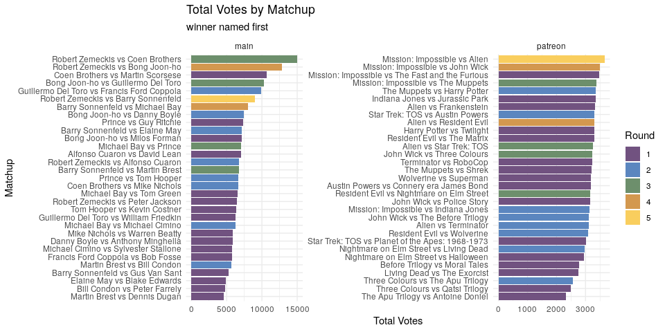
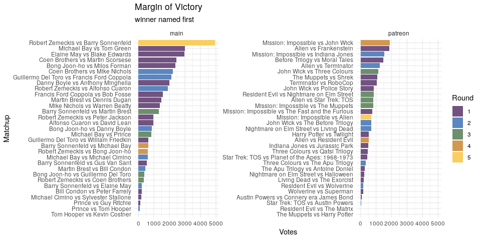
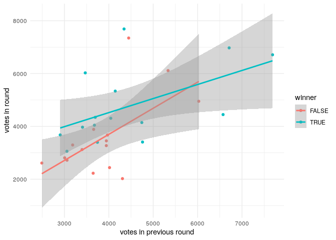
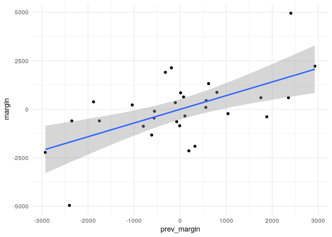

<!-- --><!-- -->

<!-- -->

<!-- -->

Votes in previous round aren't a good predictor for votes.  

<!-- -->

Hypothetical Margin of previous round is not a good predictor of current margin.  

<!-- -->

Likely need to account for the matchup, not just general preference.  

<!--html_preserve-->

<!--/html_preserve-->

